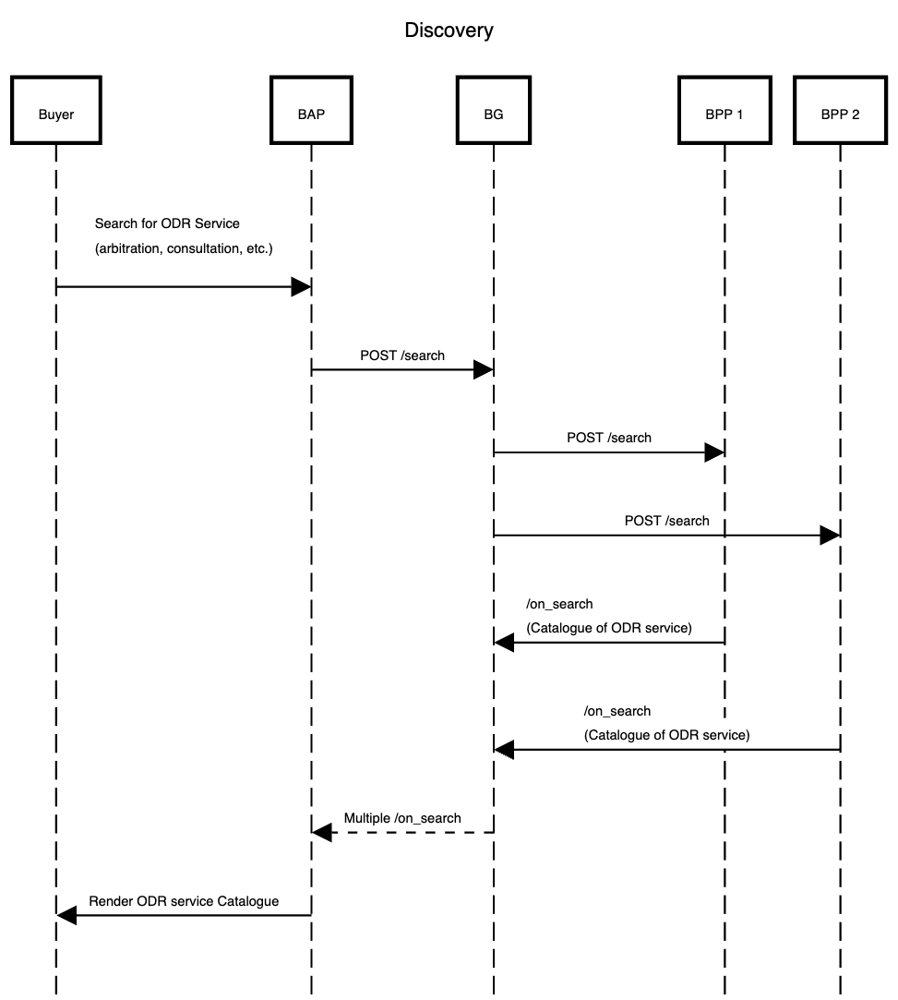
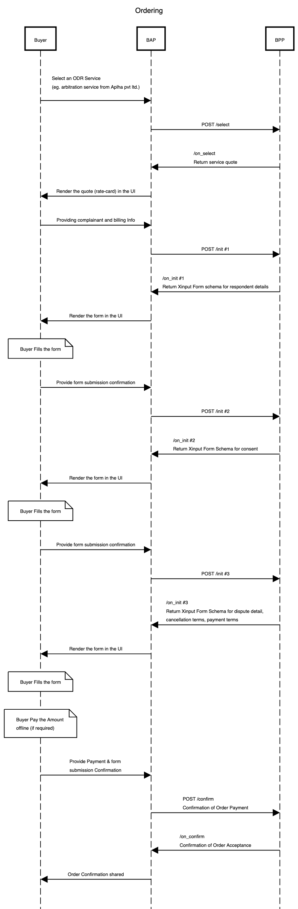
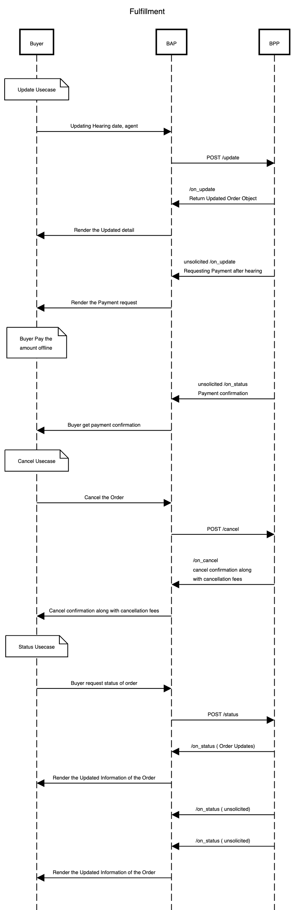
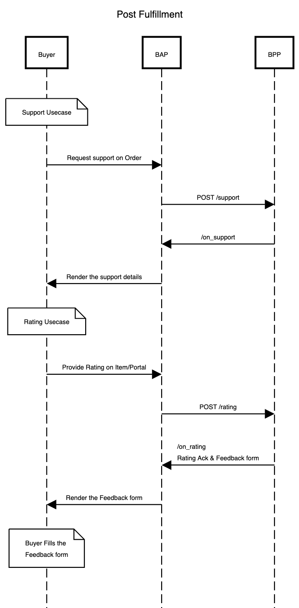

## A Generic Workflow for a Unified ODR service

### Overview

Any online dispute resolution consists of the following interactions. Bear in mind, this is just an example workflow for a simple transaction between a complainant and a service provider. The order of interactions between the two parties is arbitratrily selected on the basis of several interviews with subject matter experts.

A typical workflow for an online dispute consits of the following steps

#### Step 1: Complainant researches and selects a dispute service provider

The complainant researches various dispute resolution services to find the most suitable options for a dispute. They compare the category of dispute, the expertise of the provider and the common consensus between the complainant and the respondent to make an informed decision.

#### Step 2: Complainant submits all the information

The complainant fills out an application form provided by the chosen dispute service provider.
The application forms typically requires personal details such as name, address, contact information along with details of the respondent. Before uploading the case documents, the service provider asks for consent from the complainant.

#### Step 3: ODR platform reviews the case information and evaluates the documents

The ODR platform reviews the dispute information submitted by the complainant. The ODR platform confirms the creation of a new dispute order and asks the complainant to complete the payment. The payment structure could vary based on the case.

#### Step 4: ODR platform requests the complainant for more information

After the case/dispute order has been confirmed, the ODR platform instructs the complainant to proceed to the ODR platform to complete the other procedures related to the dispute.

#### Step 5: ODR platform assigns a case agent

After the ODR platform has reviewed the case details, a case agent is assigned who will work to resolve the complaint/dispute

#### Step 6: ODR platform assigns a hearing date

The dispute might require a hearing to conclude the decision, the hearing date for that dispute it updated to the complainant.

#### Step 6: ODR platform resolves the dispute and completes the process

The agent of the ODR platform resolves the dispute and updates the complainant about the final decision of the dispute. The ODR platforms will regularly update the customer with the status of the dispute.

According to beckn protocol, any consumer-provider interaction can be broken down into four stages namely, Discovery, Ordering, Fulfillment and Post-Fulfillment. Without loss of generality, let us break the above dispute resolution process into the four stages and describe the subinteractions that occur within them.

## Discovery (Discovering ODR service providers and their services)

In this stage, many interactions can happen like,

1. Complainant declares their Intent to one or more ODR platforms
2. ODR platform publishes their catalog of dispute resolution services

### Complainant-side Actions

A Complainant can declare their intent in many ways like

- Searching for a Dispute Resolution Provider by its name or code
- Searching for Dispute Resolution Providers based on rating
- Searching for Dispute Resolution Products by its name / code
- Searching for Dispute Resolution Products by its category name / code
- Searching for Dispute Resolution Products by price
- Viewing the catalog of Dispute Resolution Products of the provider
- Viewing the details of a Dispute Resolution provider
- Viewing the details of a particular Dispute Resolution Product

### ODR platform-side Actions

In this interaction, the Dispute Resolution Provider publishes their catalog of products. A Dispute Resolution Provider can publish various types of catalogs like,

- Catalog of Dispute Resolution Products
- Catalog of Dispute Resolution Product Categories
- Catalog of Dispute Resolution Providers
- Catalog containing details of a single provider
- Catalog of a Dispute Resolution provider containing details of a single product

### Beckn Protocol API Logical Workflow

In beckn protocol, the search intent generated by the Complainant Platform (BAP) is typically published on the gateway (BG) that broadcasts the intent to multiple provider platforms (BPPs). Each of the BPPs return their catalogs directly to the BAP via asynchronous callbacks. The workflow for that is shown below.

## Ordering (Case/Dispute Application Stage)

Creating a case for a dispute consists of multiple interactions like,

### Complainant-side actions

1. Selecting a provider
2. Submitting the details to create the dispute
3. Sharing respondent information, dispute details
4. Submitting the case documents and completing the payment

### ODR platform-side actions

1. Requesting the details to create the dispute
2. Requesting respondent information, dispute details
3. Requesting the case documents and asking for the payment
4. Creating the dispute/case order

### Beckn Protocol API Logical Workflow
The below diagram illustrates the logical interactions between an OCP and an ODR during the Dispute Application stage.

## Fulfillment (Order Status, Updates and Cancellation)

Complainant will check the dispute details and confirms the dispute with payment (might also update the order)
Post payment complainant will get updates about the dispute

### User-side Actions

- Requests to fetch the latest status of the dispute
- Requests to cancel the dispute

### Provider-side Actions

- Send status of the dispute to the complainant
- Send dispute agent details and hearing date updates to the complainant
- Cancel the dispute if the complainant wants the dispute to be cancelled.

### Beckn API Logical Worklow

## Post-Fulfillment (Order rating and support)

### User-side Actions

- Request to rate the order
- Request to get support for the dispute

#### Provider-side Actions

- Rates the order of the BAP
- Provides support to the BAP

### Order Rating and Order Support

#### Beckn API Logical Worklow

